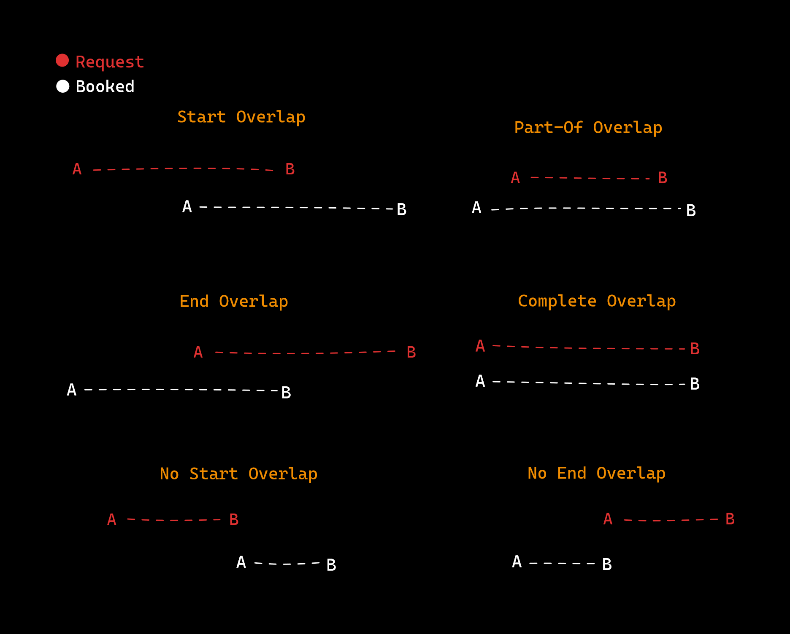
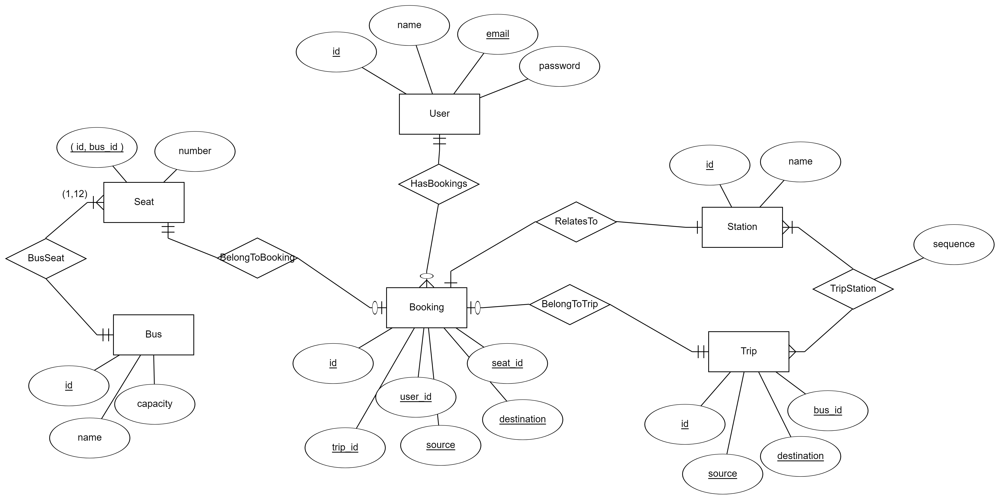

## Fleet: A RESTful API for booking bus trips

The API is minimal and simple on purpose to focus on the main task, refer to the [endpoints](#6-endpoints) section for more details.

Consider to checkout the [missings](#8-missings) section for the missing features.

### About the algorithm: Overlapping



### 0. Pre-requisites
```
- PHP 8.2.6
- Composer 2.5.5
- Postgres 14.7
```

### 1. Installation
```shell
git clone https://github.com/omarabdelaz1z/bus-booking
cd bus-booking
composer install
```

### 2. Configuration
- Copy the `.env.example` file to `.env` and update the database credentials.
- Generate the application key.
```shell
cp .env.example .env
php artisan key:generate
```

### 3. Database
- Run the database migrations.
- Or use the dump file [schema.sql](/database_dump/schema.sql) to import the database.
```shell
php artisan migrate --seed
```

### 4. Run the application
```shell
php artisan serve
```

### 5. Testing
```shell
php artisan test
```

### 6. Endpoints

| Method | Endpoint | Token  | Description | Payload |
| ------------- | ------------- | ------------- | ------------- | ------------- |
| POST  | /api/auth/login  | | Login | ```{email, password}``` |
| POST  | /api/auth/register  | | Register | ```{name, email, password}``` |
| DELETE  | /api/auth/logout  | Yes | Logout | |
| GET  | /api/me  | Yes | Get current user info | | 
| GET  | /api/trips/{id}?source=&destination | Yes | List available trips | |
| POST  | /api/users/{id}/bookings | Yes | Book a trip | `{trip, seat, source, destination}` |


### 7. ERD

I used [ERDPlus](https://erdplus.com/) to design the database schema.


### 8. To-Do
**User Roles and Permissions**.
- Since the API is minimal, I didn't implement roles and permissions.

**Partial Overlap Constraints**
- The algorithm fails when the requested trip is part of the booked entries not the other way around.

**Dockerize The App**
- I know what docker is in general but I didn't have the time to explore it and implement it.

